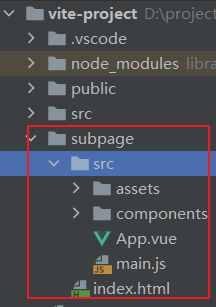

# 多文件项目

`vite` 项目要配置多文件入口 需要完成两个操作

1. 创建第二个 html 文件的配套内容 如图:
   
2. 配置 vite.config.js 为项目添加页面的入口路径，如:
   ```js
   import {defineConfig} from 'vite'
   import vue from '@vitejs/plugin-vue'
   import path from 'path'

   export default defineConfig({
       build: {
           rollupOptions: {
               input: {
                   main: path.join(__dirname, './index.html'),
                   subpage: path.join(__dirname, './subpage/index.html')
               }
           }
       },
       plugins: [vue()]
   })
   ```
